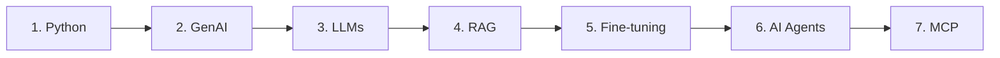

# 🤖 Blueprint of AI — Live Class Series

Welcome to the official code and resource repository for the **Blueprint of AI** ([@BlueprintOfAI](https://www.youtube.com/@BlueprintOfAI)) Live Class Series!

This curriculum is designed for Python developers, working professionals, and students looking to master practical skills and transition into **Artificial Intelligence**, **Generative AI**, and **Agentic AI** roles.

---

## 🎯 Who Is This For?

- **Python Developers** specializing in GenAI and Autonomous AI Agents.
- **Career Switchers & Engineers** (including non-CS backgrounds) transitioning into AI / Data Science.
- **Students & Graduates** building portfolio projects and core AI competencies.

---

## 🗺️ Curriculum Roadmap

Our structured learning path takes you step-by-step from core Python foundations to advanced Agentic AI architectures:



1. **Python for GenAI** — Python essentials optimized for AI data pipelines and API handling.
2. **GenAI Fundamentals** — Generative concepts, prompt engineering, and foundational architectures.
3. **LLMs (Large Language Models)** — API integration, structured outputs, tokenomics, and embeddings.
4. **RAG (Retrieval-Augmented Generation)** — Vector databases, document processing, semantic search.
5. **Fine-Tuning** — Customizing open-weight models for domain-specific tasks.
6. **AI Agents** — ReAct frameworks, function calling, tool integration, and multi-agent coordination.
7. **MCP (Model Context Protocol)** — Standardized context protocol for modern AI tools and services.

---

## 📺 Class Directory & Stream Links

| Session | Topic | Notebook | Stream Recording |
| :--- | :--- | :---: | :---: |
| **Class 1** | Python for GenAI & Agentic AI | 📓 [class-1_basic.ipynb](python/class-1_basic.ipynb) | 🎬 [Watch Recording](https://www.youtube.com/live/F7NAM5gc8o4?si=prxGdvyf5f4soxB6) |
| **Class 2** | Conditionals & Loops | 📓 [class-2_Conditionals_Loops_Lists.ipynb](python/class-2_Conditionals_Loops_Lists.ipynb) | 🎬 [Watch Recording](https://www.youtube.com/live/CVmk5_dcxjs?si=OGnORuWU42U0BdKJ) |
| **Class 3** | Lists, Tuples, Dictionaries & Sets | 📓 [Class-3_Lists_Tuples_Dictionaries_Sets.ipynb](python/Class-3_Lists_Tuples_Dictionaries_Sets.ipynb) | 🎬 [Watch Stream](https://youtube.com/playlist?list=PLIB2_OGEI7SI&si=t61zJPJAG82t1jzv) |
| **Upcoming** | *Next sessions in pipeline...* | 🟡 Coming Soon | 🔔 Subscribe for notifications |

▶️ **[Access the Full YouTube Playlist](https://youtube.com/playlist?list=PLIB2_OGEI7SI&si=t61zJPJAG82t1jzv)**

---

## 💡 Session-Wise Interview Questions (Click Session to Expand)

<details>
<summary><b>Class 1: Python for GenAI & Agentic AI — Interview Question</b></summary>

<br>

### ❓ Question:
How are Python's primitive data types (`str`, `int`, `float`, `bool`) used when interacting with Generative AI and LLM APIs? Provide a practical code snippet.

### 💡 Answer:
In AI engineering, standard Python types map directly to core API request payloads and hyperparameter configs:
- **`str` (String)**: Used for prompt messages, model names, system instructions, and generated output text.
- **`int` (Integer)**: Configures limits and parameters like `max_tokens`, `top_k`, and candidate completion count `n`.
- **`float` (Float)**: Configures hyperparameters like `temperature`, `top_p`, `frequency_penalty`, and represents vector embedding values.
- **`bool` (Boolean)**: Used for feature flags such as `stream=True` (for streaming tokens) or `json_mode=True`.

```python
# Practical Example: Structuring an LLM API Request Payload
api_payload = {
    "model": "gpt-4o",           # str: Model Identifier
    "temperature": 0.7,          # float: Sampling Temperature
    "max_tokens": 250,           # int: Maximum Output Tokens
    "stream": True               # bool: Enable Token Streaming
}
```

</details>

<details>
<summary><b>Class 2: Conditionals & Loops — Interview Question</b></summary>

<br>

### ❓ Question:
How do `while` loops, `for` loops, and `if/elif/else` conditional statements form the backbone of an Autonomous AI Agent execution loop (ReAct Pattern)?

### 💡 Answer:
Autonomous Agents execute in continuous **Thought → Action → Observation** cycles:
- **`while` Loop**: Keeps the agent active, allowing it to repeatedly query the LLM and execute tools until an exit condition is met or a `max_iterations` limit is hit (preventing infinite execution loops).
- **`if / elif / else` Statements**: Inspects the LLM's response to route execution — determining whether to call a specific tool function (`calculator`, `web_search`) or return the final response to the user.
- **`break` / Exit Flags**: Terminates the agent run-loop once a final answer is synthesized or an unrecoverable error occurs.

```python
# Practical Example: Basic Agent Execution Loop
max_steps = 5
step = 0
agent_running = True

while agent_running and step < max_steps:
    step += 1
    llm_decision = get_agent_thought_and_action()
    
    if llm_decision["action"] == "final_answer":
        print("Final Output:", llm_decision["answer"])
        agent_running = False  # Loop exit condition
    elif llm_decision["action"] == "web_search":
        result = execute_search(llm_decision["query"])
    elif llm_decision["action"] == "calculator":
        result = execute_calculator(llm_decision["expr"])
    else:
        print("Unknown action encountered.")
        break
```

</details>

<details>
<summary><b>Class 3: Lists, Tuples, Dictionaries & Sets — Interview Question</b></summary>

<br>

### ❓ Question:
Compare Python Lists, Tuples, Dictionaries, and Sets in the context of LLM API integration and RAG (Retrieval-Augmented Generation) pipelines. When should you use each?

### 💡 Answer:

| Data Structure | Core Characteristic | GenAI / RAG Application |
| :--- | :--- | :--- |
| **Dictionary (`dict`)** | Key-Value pairs, fast key lookup | API request payloads, JSON response parsing, tool definition schemas |
| **List (`list`)** | Ordered, mutable collection | Chat message histories (`[{"role": "user", ...}]`), dense vector embedding arrays (`[0.012, -0.045, ...]`) |
| **Tuple (`tuple`)** | Ordered, immutable collection | Embedding vector dimensions `(1536,)`, immutable API credentials/endpoints |
| **Set (`set`)** | Unordered, unique elements | Deduplicating retrieved RAG document IDs, tracking unique tool names |

```python
# Practical GenAI Data Structures Example

# 1. List of Dicts: Standard Chat Memory Format
messages = [
    {"role": "system", "content": "You are a helpful AI assistant."},
    {"role": "user", "content": "Explain RAG in simple terms."}
]

# 2. Set: RAG Document Deduplication
retrieved_doc_ids = {"doc_101", "doc_102", "doc_101", "doc_103"}  # -> {'doc_101', 'doc_102', 'doc_103'}

# 3. Tuple: Immutable Metadata Dimensions
embedding_dimensions = (1536, "text-embedding-3-small")
```

</details>

---

## 💻 Notebooks & Practical Notes

- **GenAI Contextual Coding:** All code examples contain inline GenAI annotations (e.g., connecting Python Dictionaries & JSON to LLM API responses).
- **Clean & Merged Notebooks:** Code materials are updated and trimmed between sessions to focus on high-yield, topic-specific exercises.

---

## 🔗 Official Links & Channel

- **YouTube:** [@BlueprintOfAI](https://www.youtube.com/@BlueprintOfAI)
- **Playlist:** [GenAI & Agentic AI Live Course Playlist](https://youtube.com/playlist?list=PLIB2_OGEI7SI&si=t61zJPJAG82t1jzv)