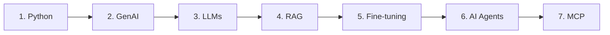

# 🤖 Blueprint of AI — Live Class Series

Welcome to the official code and resource repository for the **Blueprint of AI** ([@BlueprintOfAI](https://www.youtube.com/@BlueprintOfAI)) Live Class Series!

This curriculum is designed for Python developers, working professionals, and students looking to master practical skills and transition into **Artificial Intelligence**, **Generative AI**, and **Agentic AI** roles.

---

## 🎯 Who Is This For?

- **Python Developers** specializing in GenAI and Autonomous AI Agents.
- **Career Switchers & Engineers** (including non-CS backgrounds) transitioning into AI / Data Science.
- **Students & Graduates** building portfolio projects and core AI competencies.

---

## 🗺️ Curriculum Roadmap

Our structured learning path takes you step-by-step from core Python foundations to advanced Agentic AI architectures:



1. **Python for GenAI** — Python essentials optimized for AI data pipelines and API handling.
2. **GenAI Fundamentals** — Generative concepts, prompt engineering, and foundational architectures.
3. **LLMs (Large Language Models)** — API integration, structured outputs, tokenomics, and embeddings.
4. **RAG (Retrieval-Augmented Generation)** — Vector databases, document processing, semantic search.
5. **Fine-Tuning** — Customizing open-weight models for domain-specific tasks.
6. **AI Agents** — ReAct frameworks, function calling, tool integration, and multi-agent coordination.
7. **MCP (Model Context Protocol)** — Standardized context protocol for modern AI tools and services.

---

## 📺 Class Directory & Stream Links

| Session | Topic | Notebook | Stream Recording |
| :--- | :--- | :---: | :---: |
| **Class 1** | Python for GenAI & Agentic AI | 📓 [class-1_basic.ipynb](python/class-1_basic.ipynb) | 🎬 [Watch Recording](https://www.youtube.com/live/F7NAM5gc8o4?si=prxGdvyf5f4soxB6) |
| **Class 2** | Conditionals & Loops | 📓 [class-2_Conditionals_Loops_Lists.ipynb](python/class-2_Conditionals_Loops_Lists.ipynb) | 🎬 [Watch Recording](https://www.youtube.com/live/CVmk5_dcxjs?si=OGnORuWU42U0BdKJ) |
| **Class 3** | Lists, Tuples, Sets & Dictionaries | 📓 [Class-3_Lists_Tuples_Dictionaries_Sets.ipynb](python/Class-3_Lists_Tuples_Dictionaries_Sets.ipynb) | 🎬 [Watch Recording](https://www.youtube.com/live/KRYmLfOSL3I?si=GNofNypk2izHUMPm) |
| **Class 4** | Python Functions | 📓 [Class-4_Functions.ipynb](python/Class-4_Functions.ipynb) | 🎬 [Watch Recording](https://www.youtube.com/live/MHHPitVRfzY?si=ayX_d7Zt6g3UblEi) |
| **Class 5** | Object-Oriented Programming (OOP) | 📓 [Class-5_OOP.ipynb](python/Class-5_OOP.ipynb) | 🎬 [Watch Recording](https://www.youtube.com/live/vmm1Xx-NSbk?si=LxT9nGldrhW4tqH5) |
| **Class 6** | Error Handling | 📓 [class-6_Error_Handling.ipynb](python/class-6_Error_Handling.ipynb) | 🎬 [Watch Recording](https://www.youtube.com/live/NSTgCzS8zwk?si=GqSGfVgkOhGSqGQu) |
| **Class 7** | **File Handling in Python** | 📓 [class-7_file_handling.py](python/class-7_file_handling.py) | 🎬 [Watch Recording](https://www.youtube.com/watch?v=xAoKEp3hGHY) |
| **Class 8** | FastAPI | 📓 [Class-8_FastAPI.ipynb](python/Class-8_FastAPI.ipynb) | 🎬 [Watch Recording](https://www.youtube.com/live/VTj23cei8Tc?si=nUgnuHwl4Au9Y9ul) |
| **Upcoming** | *Next sessions in pipeline...* | 🟡 Coming Soon | 🔔 Subscribe for notifications |

▶️ **[Access the Full YouTube Playlist](https://youtube.com/playlist?list=PLIB2_OGEI7SI&si=t61zJPJAG82t1jzv)**

---

## 💡 Session-Wise Interview Questions (Click Session to Expand)

<details>
<summary><b>Class 1: Python for GenAI & Agentic AI — Interview Question</b></summary>

<br>

### ❓ Question:
How are Python's primitive data types (`str`, `int`, `float`, `bool`) used when interacting with Generative AI and LLM APIs? Provide a practical code snippet.

### 💡 Answer:
In AI engineering, standard Python types map directly to core API request payloads and hyperparameter configs:
- **`str` (String)**: Used for prompt messages, model names, system instructions, and generated output text.
- **`int` (Integer)**: Configures limits and parameters like `max_tokens`, `top_k`, and candidate completion count `n`.
- **`float` (Float)**: Configures hyperparameters like `temperature`, `top_p`, `frequency_penalty`, and represents vector embedding values.
- **`bool` (Boolean)**: Used for feature flags such as `stream=True` (for streaming tokens) or `json_mode=True`.

```python
# Practical Example: Structuring an LLM API Request Payload
api_payload = {
    "model": "gpt-4o",           # str: Model Identifier
    "temperature": 0.7,          # float: Sampling Temperature
    "max_tokens": 250,           # int: Maximum Output Tokens
    "stream": True               # bool: Enable Token Streaming
}
```

</details>

<details>
<summary><b>Class 2: Conditionals & Loops — Interview Question</b></summary>

<br>

### ❓ Question:
How do `while` loops, `for` loops, and `if/elif/else` conditional statements form the backbone of an Autonomous AI Agent execution loop (ReAct Pattern)?

### 💡 Answer:
Autonomous Agents execute in continuous **Thought → Action → Observation** cycles:
- **`while` Loop**: Keeps the agent active, allowing it to repeatedly query the LLM and execute tools until an exit condition is met or a `max_iterations` limit is hit (preventing infinite execution loops).
- **`if / elif / else` Statements**: Inspects the LLM's response to route execution — determining whether to call a specific tool function (`calculator`, `web_search`) or return the final response to the user.
- **`break` / Exit Flags**: Terminates the agent run-loop once a final answer is synthesized or an unrecoverable error occurs.

```python
# Practical Example: Basic Agent Execution Loop
max_steps = 5
step = 0
agent_running = True

while agent_running and step < max_steps:
    step += 1
    llm_decision = get_agent_thought_and_action()
    
    if llm_decision["action"] == "final_answer":
        print("Final Output:", llm_decision["answer"])
        agent_running = False  # Loop exit condition
    elif llm_decision["action"] == "web_search":
        result = execute_search(llm_decision["query"])
    elif llm_decision["action"] == "calculator":
        result = execute_calculator(llm_decision["expr"])
    else:
        print("Unknown action encountered.")
        break
```

</details>

<details>
<summary><b>Class 3: Lists, Tuples, Dictionaries & Sets — Interview Question</b></summary>

<br>

### ❓ Question:
Compare Python Lists, Tuples, Dictionaries, and Sets in the context of LLM API integration and RAG (Retrieval-Augmented Generation) pipelines. When should you use each?

### 💡 Answer:

| Data Structure | Core Characteristic | GenAI / RAG Application |
| :--- | :--- | :--- |
| **Dictionary (`dict`)** | Key-Value pairs, fast key lookup | API request payloads, JSON response parsing, tool definition schemas |
| **List (`list`)** | Ordered, mutable collection | Chat message histories (`[{"role": "user", ...}]`), dense vector embedding arrays (`[0.012, -0.045, ...]`) |
| **Tuple (`tuple`)** | Ordered, immutable collection | Embedding vector dimensions `(1536,)`, immutable API credentials/endpoints |
| **Set (`set`)** | Unordered, unique elements | Deduplicating retrieved RAG document IDs, tracking unique tool names |

```python
# Practical GenAI Data Structures Example

# 1. List of Dicts: Standard Chat Memory Format
messages = [
    {"role": "system", "content": "You are a helpful AI assistant."},
    {"role": "user", "content": "Explain RAG in simple terms."}
]

# 2. Set: RAG Document Deduplication
retrieved_doc_ids = {"doc_101", "doc_102", "doc_101", "doc_103"}  # -> {'doc_101', 'doc_102', 'doc_103'}

# 3. Tuple: Immutable Metadata Dimensions
embedding_dimensions = (1536, "text-embedding-3-small")
```

</details>

<details>
<summary><b>Class 4: Python Functions — Interview Question</b></summary>

<br>

### ❓ Question:
How would you design a reusable function for calling an LLM when the caller may provide optional settings such as `model`, `temperature`, and `max_tokens`?

### 💡 Answer:
Use explicit parameters for required inputs and `**kwargs` for optional named settings. This keeps the function easy to call while allowing new API options to be added without changing its signature. Default values can be merged with caller-provided settings.

```python
def build_llm_config(model="gpt-3.5", temperature=0.5, **settings):
    config = {
        "model": model,
        "temperature": temperature,
    }
    config.update(settings)
    return config

config = build_llm_config(
    model="gpt-4",
    temperature=0.7,
    max_tokens=500,
)
```

</details>

<details>
<summary><b>Class 5: Object-Oriented Programming (OOP) — Interview Question</b></summary>

<br>

### ❓ Question:
How can OOP be used to model different AI assistants while keeping their state and behavior organized?

### 💡 Answer:
Create a base class for shared state and behavior, then use inheritance and method overriding for specialized assistants. Each object keeps its own attributes, such as conversation history, while polymorphism allows different assistant types to expose the same method with different implementations.

```python
class Assistant:
    def __init__(self, name):
        self.name = name
        self.history = []

    def respond(self, message):
        self.history.append(message)
        return f"[{self.name}] {message}"


class RAGAssistant(Assistant):
    def respond(self, message):
        return f"[{self.name}] Searching documents for: {message}"
```

</details>

<details>
<summary><b>Class 6: Error Handling — Interview Question</b></summary>

<br>

### ❓ Question:
Why should an application catch specific exceptions instead of using a bare `except` block when processing user input or an API response?

### 💡 Answer:
Specific exceptions make the failure understandable and prevent unrelated programming errors from being hidden. For example, invalid user input should be handled as a `ValueError`, while a missing file should be handled as a `FileNotFoundError`. `finally` can be used for cleanup that must happen whether the operation succeeds or fails.

```python
try:
    age = int(user_input)
except ValueError:
    print("Please enter a valid number.")
else:
    print("Age accepted:", age)
finally:
    print("Input processing finished.")
```

</details>

<details>
<summary><b>Class 7: File Handling in Python — Interview Question</b></summary>

<br>

### ❓ Question:
How would you persist an AI agent's configuration to a file and load it safely when the application starts?

### 💡 Answer:
Use the `json` module for structured configuration and open files with a context manager so they are closed automatically. `encoding="utf-8"` supports text consistently, and exceptions such as `FileNotFoundError` or `json.JSONDecodeError` can be handled to provide a useful fallback.

```python
from pathlib import Path
import json

config_path = Path("agent_config.json")
config = {"model": "gpt-4", "temperature": 0.2}

with config_path.open("w", encoding="utf-8") as file:
    json.dump(config, file, indent=2)

with config_path.open("r", encoding="utf-8") as file:
    loaded_config = json.load(file)
```

</details>

<details>
<summary><b>Class 8: FastAPI — Interview Question</b></summary>

<br>

### ❓ Question:
How would you expose a Python function as a validated API endpoint that could later power an LLM or RAG application?

### 💡 Answer:
Define a FastAPI application, use an HTTP method that matches the operation, and declare a request model with Pydantic. FastAPI uses the type hints to validate incoming data and generate OpenAPI documentation automatically. A `POST` endpoint is appropriate when the client sends a prompt or note to be processed.

```python
from fastapi import FastAPI
from pydantic import BaseModel

app = FastAPI()


class ChatRequest(BaseModel):
    prompt: str
    temperature: float = 0.7


@app.post("/chat")
def chat(request: ChatRequest):
    return {"reply": f"Received: {request.prompt}"}
```

</details>

---

## 💻 Notebooks & Practical Notes

- **GenAI Contextual Coding:** All code examples contain inline GenAI annotations (e.g., connecting Python Dictionaries & JSON to LLM API responses).
- **Clean & Merged Notebooks:** Code materials are updated and trimmed between sessions to focus on high-yield, topic-specific exercises.

---

## 🔗 Official Links & Channel

- **YouTube:** [@BlueprintOfAI](https://www.youtube.com/@BlueprintOfAI)
- **Playlist:** [GenAI & Agentic AI Live Course Playlist](https://youtube.com/playlist?list=PLIB2_OGEI7SI&si=t61zJPJAG82t1jzv)